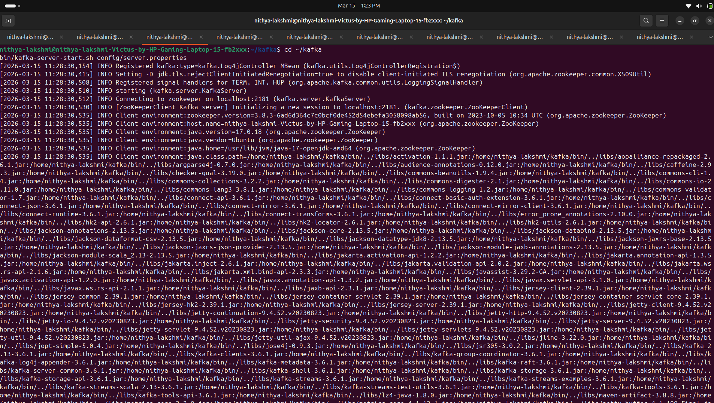

# Big Data Streaming Project

This project demonstrates real-time data processing using:

- Apache Kafka
- Apache Spark Structured Streaming
- Hadoop HDFS
- Python

Pipeline:

Python Producer → Kafka → Spark Streaming → HDFS → Spark SQL

## Project Structure

bigdata_streaming
│
├ producer
│   └ log_producer.py
│
├ spark
│   └ kafka_stream.scala
│
├ screenshots
│   ├ kafka_topic.png
│   ├ spark_streaming.png
│   ├ hdfs_logs.png
│   └ sql_output.png
│
└ README.md

## Project Screenshots

### Kafka Topic Messages

### Spark Streaming Output

### HDFS Stored Logs

### SQL Query Output

